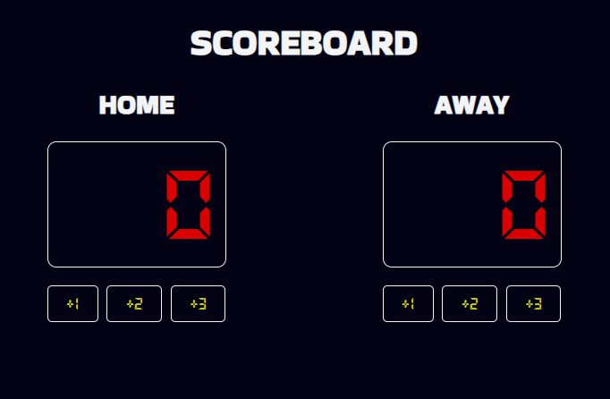

# basketball_scoreboard
Simple scoreboard project using Javascript as programming language.

Scores are increased by either 1, 2, or 3.

# try app here:  

  <a href="https://smdev-scoreboard.netlify.app/">
    
  <a>

